# deepaaa-dipaaa
deep dip with aaaa

 
 

Notes:

1. The songs are pic completely randomly. The `1st sone` is influence by `Instagram 2nd story`. and the `2nd song recommended by Google music`. I really not understand the Tamil language at this time (13/09/2025). Those songs used only for friendly purpose, not for any emotional situations.

2. "deep dip" inspire by `names` which gives a unique identity of this repo, and it's also helps to recall the little story of those days.

3. `"aaaa"` is your voice action. Example: "Haaaaa..." mean "Yes" like that. It's a common action for Indian South peoples which sounds very `attractive` and `beautiful` for north (i from WB) peoples.

 
 

Thangs for understanding. 
Akashdip, TCS Terquoise 2025

---

## 🎯 Complete Website Flow Diagram

```mermaid
flowchart TD
    A[👤 User Visits Website] --> B{🔍 User Type Detection}
    
    B -->|😐 Casual Visitor| C[🚫 Sees Fake 404 Error Page<br/>index.html]
    B -->|👨‍💻 Developer| D[🧐 Notices @RequestMapping<br/>Spring Boot Code]
    
    C --> C1[😴 Gets Bored & Leaves<br/>Mission Accomplished!]
    
    D --> E{🤔 Developer Curiosity}
    E -->|🔗 Clicks api/memories| F[🎉 Easter Egg Discovery!<br/>api/memories/sample.html]
    E -->|🔗 Clicks api/journey| G[🚀 Portal Discovery!<br/>api/journey/sample.html]
    
    F --> H[⏳ Terminal Theme<br/>3 Second Countdown]
    G --> I[✨ Portal Theme<br/>3 Second Countdown]
    
    H --> J[🌸 Beautiful Message Page<br/>message.html]
    I --> J
    
    J --> K{🌸 Secret Trigger<br/>Flower Icon}
    K -->|👆 Click| L[💝 Hidden Heartfelt Message<br/>Personal Note Appears]
    K -->|🎯 Enter Button| M[🎵 Main Website<br/>main.html]
    
    M --> N[🎶 Audio Experience<br/>song10.mp3 Controls]
    N --> O{🔗 You are Men Links}
    O -->|👆 Click| P[🎵 Play song10.mp3<br/>Stop Other Audio]
    
    L --> L1[❌ Close Message<br/>Return to Page]
    L1 --> K
    
    style A fill:#e1f5fe
    style C fill:#ffebee
    style C1 fill:#fce4ec
    style D fill:#f3e5f5
    style F fill:#e8f5e8
    style G fill:#e8f5e8
    style J fill:#fff3e0
    style L fill:#fff8e1
    style M fill:#e3f2fd
    style P fill:#e8f5e8
```

## 🎨 Visual Features

```mermaid
graph LR
    A[🍃 Leaf Animations] --> B[index.html<br/>Normal Speed<br/>Some in Front]
    A --> C[message.html<br/>Slower Speed<br/>All Behind]
    
    D[🎨 Typography] --> E[Kalam Font<br/>Handwritten Style]
    D --> F[Mobile Optimized<br/>Responsive Design]
    
    G[🌸 Secret Elements] --> H[Hidden Trigger<br/>Flower Icon]
    G --> I[Easter Eggs<br/>Developer Hints]
    
    style A fill:#c8e6c9
    style D fill:#b39ddb
    style G fill:#ffcc80
```

## 🔄 User Journey States

## 🎵 Audio System Flow

---
